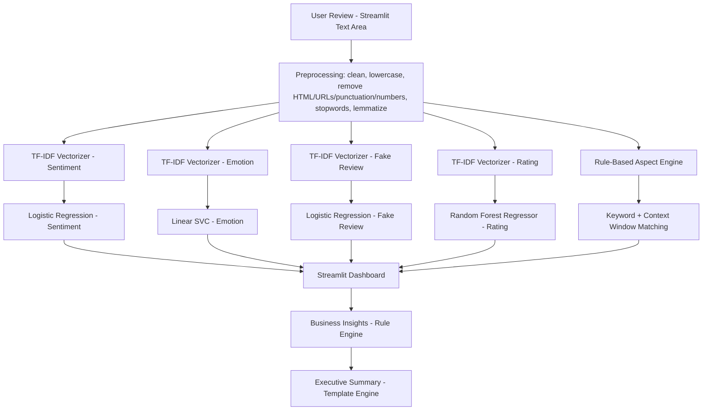

# 🤖 InsightAI – Customer Feedback Intelligence Platform


> Paste a customer review. Get instant sentiment, emotion, authenticity, star rating, aspect-level breakdown, business insights, and an AI-generated executive summary — all in one dashboard.

<p align="center">
  
</p>

---

## 📖 Overview

**InsightAI** is a Streamlit web application that analyzes a single customer review using **four independently trained Machine Learning models** and **one rule-based NLP engine**, then presents the combined results as a business-facing dashboard: an overview panel, AI report cards, an aspect-based sentiment breakdown, actionable business insights, and a narrative executive summary.

All models are trained offline in Jupyter notebooks and shipped as `.pkl` files (via `joblib`), loaded once at app startup and served through a lightweight `modules/` package.

---

## ✨ Features

- 📝 Free-text review input with a single "Analyze" action
- 😊 **Sentiment Analysis** (Positive / Negative)
- 🎭 **Emotion Detection** (Happy, Sad, Angry, Frustrated, Satisfied)
- 🛡️ **Fake Review Detection** (Genuine / Fake)
- ⭐ **Star Rating Prediction** (1–5, regression based)
- 🔍 **Aspect-Based Sentiment Analysis** (rule-based: Quality, Delivery, Packaging, Price, Customer Service, Battery, Performance)
- 📊 Auto-generated dashboard overview with key metrics
- 💡 Rule-based **Business Insight** recommendations
- 📝 Auto-generated **Executive Summary** narrative
- 🎨 Fully custom-styled UI (no external component libraries)

---

## 🏗️ Architecture



---

## 📁 Folder Structure

```
InsightAI1/
│
├── app.py                     # Streamlit UI + orchestration of all models
├── test.py                    # Manual smoke test for fake_review module
├── requirements.txt           # Python dependencies
├── README.md
│
├── modules/
│   ├── preprocessing.py       # Shared text cleaning pipeline (used by all models)
│   ├── sentiment.py           # Loads sentiment model + vectorizer, predicts Positive/Negative
│   ├── emotion.py              # Loads emotion model + vectorizer, predicts 1 of 5 emotions
│   ├── fake_review.py         # Loads fake-review model + vectorizer, predicts Genuine/Fake
│   ├── rating_prediction.py   # Loads rating model + vectorizer, predicts 1–5 star rating
│   └── aspect_analysis.py     # Rule-based keyword + context-window aspect sentiment engine
│
├── models/                    # Trained artifacts (joblib .pkl)
│   ├── sentiment_model.pkl / vectorizer.pkl
│   ├── emotion_model.pkl / emotion_vectorizer.pkl
│   ├── fake_review_model.pkl / fake_review_vectorizer.pkl
│   └── rating_model.pkl / rating_vectorizer.pkl
│
├── datasets/                  # Raw CSV training data
│   ├── IMDB_Dataset_CLEANED.csv      (Sentiment)
│   ├── deceptive-opinion.csv         (Fake Review)
│   ├── goemotions_1/2/3.csv          (Emotion)
│   ├── amazon_reviews.csv            (Rating)
│   └── fake reviews dataset.csv      (present, currently unused)
│
├── Sentiment_Training.ipynb
├── Emotion_Training.ipynb
├── FakeReview_Training.ipynb
├── rating_prediction.ipynb
│
├── assets/                    # (currently empty – place images here)
└── output/                    # (currently empty)
```

---

## ⚙️ Installation

```bash
# 1. Clone the repository
git clone <your-repo-url>
cd InsightAI1

# 2. Create and activate a virtual environment
python -m venv venv
venv\Scripts\Activate.ps1        # Windows PowerShell
# source venv/bin/activate       # macOS / Linux

# 3. Install dependencies
pip install -r requirements.txt

# 4. Download required NLTK corpora (one-time)
python -c "import nltk; nltk.download('stopwords'); nltk.download('wordnet'); nltk.download('omw-1.4')"
```

## 📦 Requirements

Key libraries (see `requirements.txt` for the full pinned list):

- `streamlit`, `pandas`, `numpy`, `scikit-learn`, `joblib`, `nltk`, `regex`

## ▶️ How to Run

```bash
streamlit run app.py
```

Then open the local URL Streamlit prints (typically `http://localhost:8501`).

---

## 🔄 Workflow (End-to-End)

1. User pastes a review into the text area and clicks **Analyze Review**.
2. The raw text is sent, independently, to four ML pipelines and one rule-based engine.
3. Each pipeline runs the shared `preprocess_text()` cleaning step, transforms the text with its own **TF-IDF vectorizer**, and calls its own trained model.
4. Results are aggregated into: Overview stats → AI Report cards → Aspect Analysis grid → Business Insights → Executive Summary.
5. Everything is rendered with custom HTML/CSS via `st.markdown(..., unsafe_allow_html=True)`.

---

## 🧠 ML Models Used

| Module | Algorithm | Type | Vectorizer | Dataset | Metric |
|---|---|---|---|---|---|
| Sentiment | Logistic Regression | Classification (binary) | TF-IDF (5000 feat.) | IMDB_Dataset_CLEANED.csv | Accuracy ≈ 88.5% |
| Fake Review | Logistic Regression | Classification (binary) | TF-IDF (5000 feat.) | deceptive-opinion.csv | Accuracy ≈ 88.8% |
| Emotion | Linear SVC | Classification (5-class) | TF-IDF (15000 feat., bigrams) | goemotions_1/2/3.csv | Accuracy ≈ 56.9% |
| Rating | Random Forest Regressor | Regression (1–5) | TF-IDF (5000 feat.) | amazon_reviews.csv | R² ≈ 0.36, MAE ≈ 0.43 |
| Aspect Analysis | Rule-based (no ML) | Keyword + context window | — | Hand-curated keyword lists | — |

## 🧪 Training Process

All models follow the same pattern in their respective notebook:
`Load CSV → Select/rename columns → Clean text (preprocess_text) → TF-IDF vectorize → train_test_split (80/20, stratified where applicable) → Fit model → Evaluate → joblib.dump(model & vectorizer)`

## 🗃️ Datasets

| Dataset | Used By | Rows (approx.) |
|---|---|---|
| IMDB_Dataset_CLEANED.csv | Sentiment | ~49,000 |
| deceptive-opinion.csv | Fake Review | ~1,600 (320 test) |
| goemotions_1/2/3.csv | Emotion | ~200,000 combined |
| amazon_reviews.csv | Rating | ~4,900 |
| fake reviews dataset.csv | *Not currently used* | ~58,900 |

---

## 🧵 Project Pipeline

```
User Review
    ↓
Preprocessing (clean, lemmatize, remove stopwords)
    ↓
Vectorization (TF-IDF, per model)
    ↓
ML Models (Sentiment / Emotion / Fake Review / Rating) + Rule-Based Aspect Engine
    ↓
Prediction Aggregation
    ↓
Business Insights (rule engine)
    ↓
Executive Summary (template-based narrative)
    ↓
Streamlit Dashboard
```

---

## 🖼️ Screenshots

_Add screenshots of the running app here._

| Overview | Aspect Analysis | Executive Summary |
|---|---|---|
| _placeholder_ | _placeholder_ | _placeholder_ |

---

## 🚀 Deployment

Currently runnable locally via `streamlit run app.py`. For cloud deployment (e.g. Streamlit Community Cloud, Render, or Docker):

- Ensure `requirements.txt` is UTF-8 encoded (it is currently UTF-16, which some platforms fail to parse).
- Add a `nltk.download(...)` bootstrap step (or vendor the corpora) since the hosting environment will not have them cached.
- Keep `models/*.pkl` in the repo (or fetch them from external storage) since predictions depend on them at runtime.

## 🔮 Future Scope

See **Part 9 — Future Improvements** in the full project audit for a detailed list (model upgrades, code modularization, CI/CD, testing, better emotion accuracy, etc.).

---

## 👤 Contributors

- Project Owner / Developer: _add your name_

## 📄 License

This project is released under the MIT License. Add a `LICENSE` file to formalize this.

## 🙏 Acknowledgements

- [GoEmotions dataset](https://github.com/google-research/google-research/tree/master/goemotions) (Emotion training data)
- [Deceptive Opinion Spam Corpus](https://myleott.com/op-spam.html) (Fake review training data)
- IMDB Movie Reviews dataset (Sentiment training data)
- Amazon Reviews dataset (Rating training data)
- Built with Streamlit, scikit-learn, and NLTK
